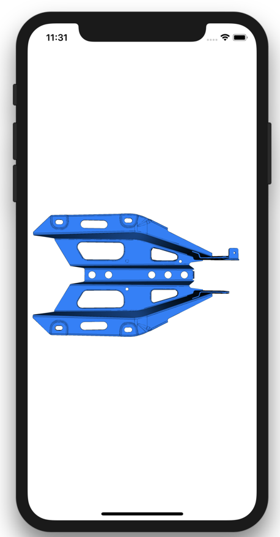

# PiWebMeshModel


## Overview

PiWebMeshModel is a framework to read CAD visualization data in MeshModel format for the ZEISS PiWeb quality data management system. To read more about the MeshModel format: https://github.com/ZEISS-PiWeb/PiWeb-MeshModel

## Requirements

* iOS 11

## Installation

PiWebMeshModel is available through [CocoaPods](http://cocoapods.org). To install
it, simply add the following line to your Podfile:

```ruby
pod 'PiWebMeshModel'
```

## Usage

```Swift
import SceneKit
import PiWebMeshModel

let model = MeshModel.init(filename: "MetalPart.meshModel")

let scene = SCNScene()
scene.rootNode.addChildNode(model)
sceneView.scene = scene

```

The MeshModel object is a SceneKitNode and can be used in any SceneKit scene.

## Example Project

An example project and examples for MeshModel files are included with this repository.  To run the example project, clone the repository and run `pod install` from the Example directory first.



## Author

David Dombrowe, dombrowe@zeiss-izm.de

## License

PiWebMeshModel is available under the BSD license. See the LICENSE file for more info.
